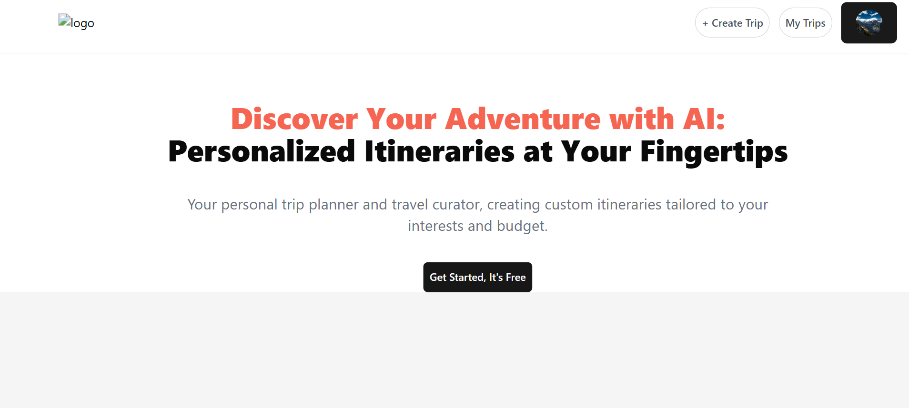
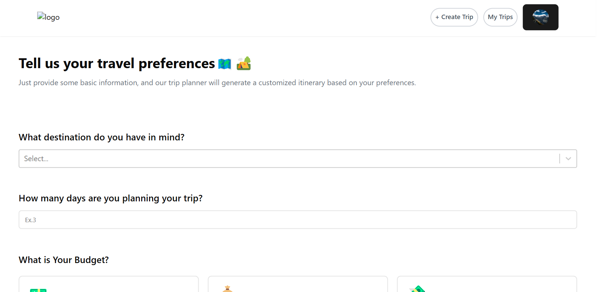
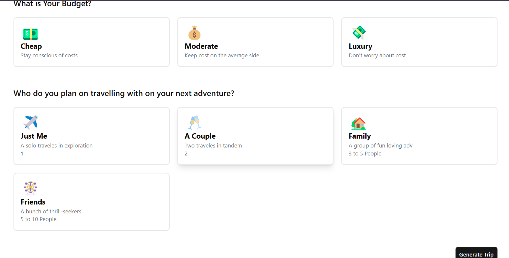
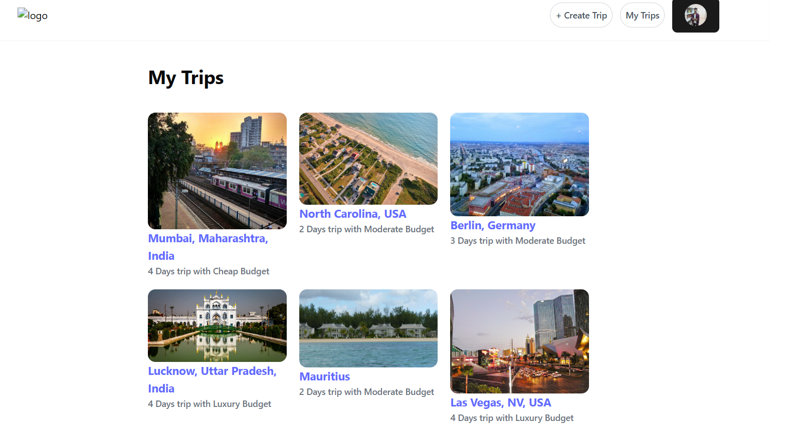
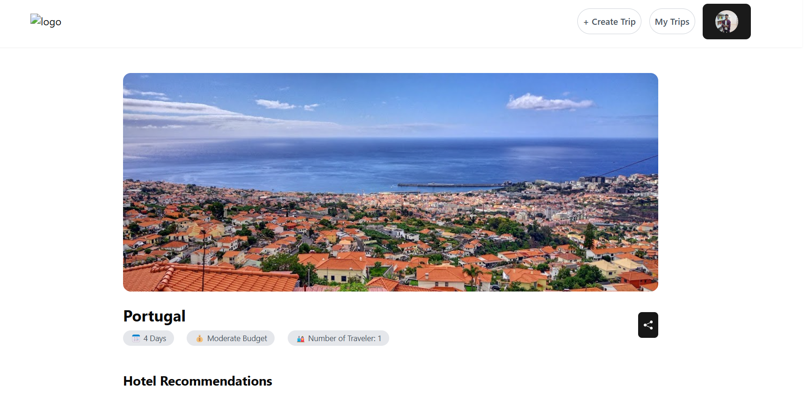
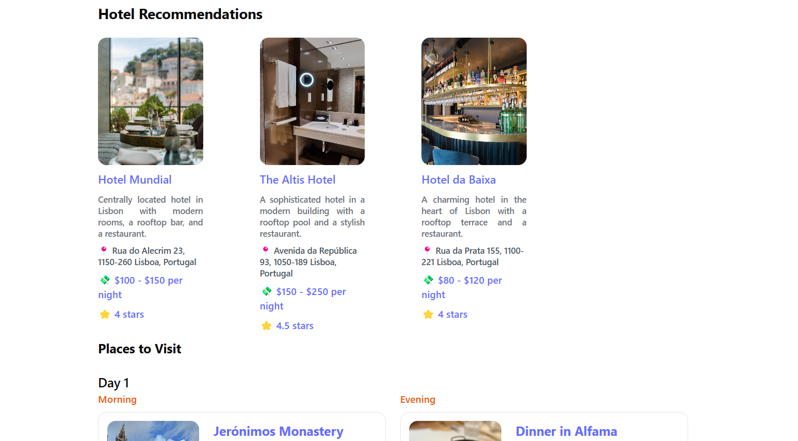
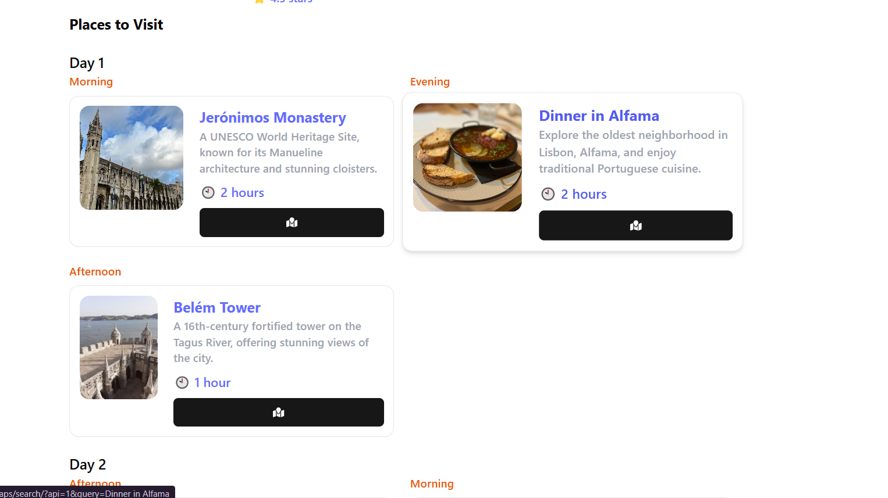
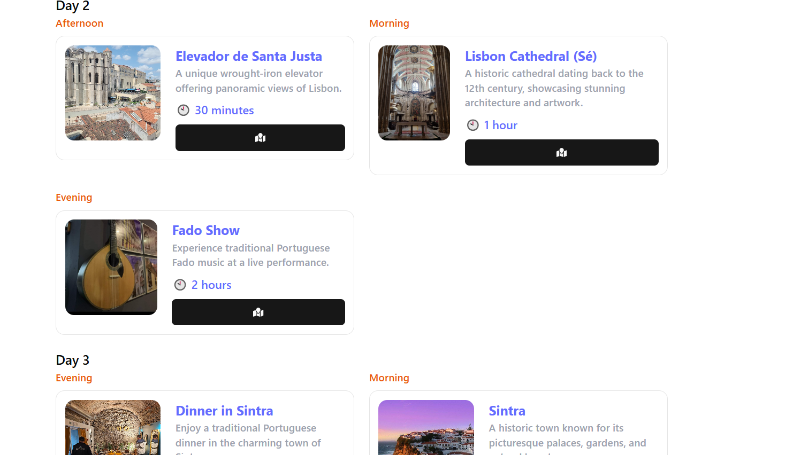
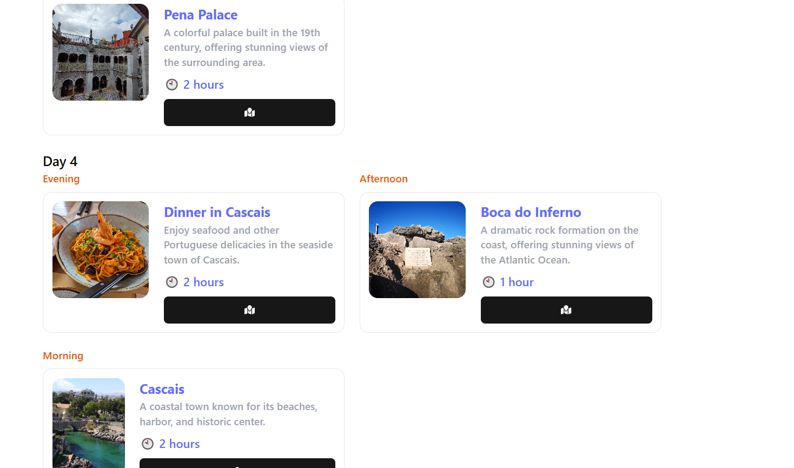

# WanderWise 🗺️  
**An AI-powered Travel Planning Website**  
Plan your next adventure with ease using WanderWise—your ultimate travel assistant. Powered by AI, WanderWise simplifies itinerary creation, budget management, and destination discovery for travelers worldwide.  

[](https://reactjs.org/)  


### ⭐ Don't forget to give the repo a star!   
[](https://github.com/ElsonNS/WanderWise-)  
[](https://github.com/ElsonNS/WanderWise-/fork)  


---

## 🌟 Features  

- **AI-Powered Itinerary Planner**  
  Automatically generate personalized travel plans based on your preferences.  

- **Budget Tracker**  
  Manage expenses with ease using an integrated budget tracking feature.  

- **Destination Insights**  
  Discover popular destinations, cultural attractions, and hidden gems.  

- **User Authentication**  
  Secure login and personalized dashboard using Firebase.  

- **Real-Time Collaboration**  
  Plan trips with friends using live collaboration tools.  

- **Responsive Design**  
  Fully optimized for mobile, tablet, and desktop devices.  

---
## 📸 Screenshots  

### Homepage  


---

### Create Trip  
<table>
  <tr>
    <td></td>
    <td></td>
  </tr>
</table>

---

### Dashboard  


---

### Trip Details  
<table>
  <tr>
    <td></td>
    <td></td>
  </tr>
  <tr>
    <td></td>
    <td></td>
  </tr>
  <tr>
    <td colspan="2" align="center"></td>
  </tr>
</table>

---

## 🚀 Installation  

### 1. Clone the Repository  

```bash
git clone https://github.com/username/WanderWise-.git
cd WanderWise
```


### 2. Install Dependencies  
Install all necessary dependencies using npm:  
```bash
npm install
```

### 3. Set Up Enviornment Variables
Create a .env.local file in the root directory and add your configuration:
```bash
NEXT_PUBLIC_FIREBASE_API_KEY=your_firebase_api_key
NEXT_PUBLIC_FIREBASE_AUTH_DOMAIN=your_firebase_auth_domain
NEXT_PUBLIC_FIREBASE_PROJECT_ID=your_project_id
NEXT_PUBLIC_FIREBASE_STORAGE_BUCKET=your_storage_bucket
NEXT_PUBLIC_FIREBASE_MESSAGING_SENDER_ID=your_messaging_sender_id
NEXT_PUBLIC_FIREBASE_APP_ID=your_app_id
```

### 4. Run the Development Server
Starat the development with: 
```bash
npm run dev
```

The application will be available at http://localhost:5173.

### 5. Build for Production 
To create an optimized production build, run: 
```bash
npm run build
```
You can prevview the build locally with:
```bash
npm run preview
```

---

## 📖 How to Use

### 1. Visit the Home Page
The homepage allows you to start creating trips instantly.

### 2. Create a Trip
Input your travel preferences (e.g., dates, budget, destinations).
Get an AI-generated itinerary tailored to your needs.

### 3. Manage Trips
View all your saved trips on the dashboard.
Edit, delete, or share trips with others.

### 4. Explore Destination Insights
Discover attractions, ticket pricing, travel times, and maps for various destinations

---

## 🛠️ Tech Stack

### Frontend: 
    React.js, TailwindCSS
### Backend: 
    Firebase (Firestore, Authentication)
### APIs: 
    Google Generative AI, Google Maps API
### Development Tools: 
    Vite

---
## 🛡️ License
This project is licensed under the MIT License. See the LICENSE file for more information.

---
## 🤝 Contributing

### Fork the Respository
Click on the "Fork" button at the top of this page.

### Create a Bracnh
Create a feature branch for your changes

```bash
git checkout -b feature/your-feature-name
```

### Commit Your Changes

```bash
git commit -m "Add some Feature"
```

### Push to the Branch

```bash
git push origin feature/your-feature-name
```

### Open a Pull Request
Submit your pull request, and I will review it as soon as possible.

---
## 🐞 Issues

### If you encounter any issues, feel free to open a Github issue at:
    https://github.com/ElsonNS/WanderWise/issues.

---


